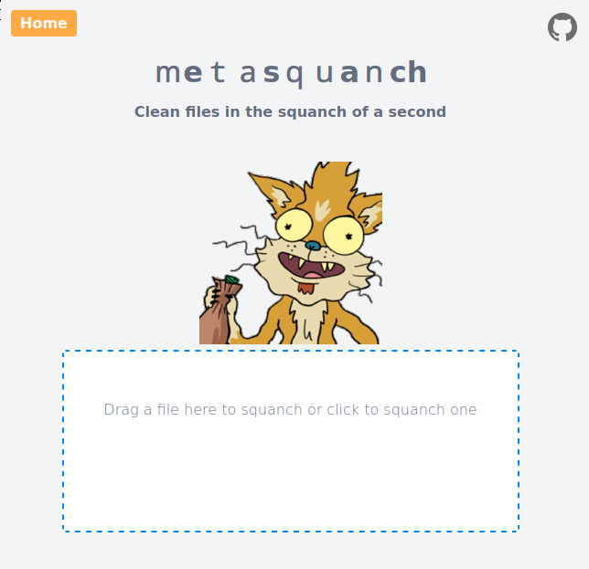

# metasquanch

metasquanch is a server application that allows ingestion of files via web upload or email to remove metadata, javascript and other unwanted parts.

- Simple web interface to upload and clean files
- Ability to monitor a mailbox, clean attachments and respond to sender
- Usage of of exiftool and qpdf in the background (more to come...)
- Ready to deploy as Node.js application, standalone docker container or using docker-compose

<p align="center">
  
</p>  
  
## Running metasquanch as Node.js application

### Prerequisites

If you plan to run metasquanch without a container runtime, be sure to install exiftool and qpdf. This can be achieved by running...

```
apt update && apt install exiftool qpdf
```

...on a Debian based OS or by running...

```
dnf install qpdf exiftool
```

...on a RedHat based OS.

### Installation

Clone the repo, adjust the environment variables and start the application:

```
https://github.com/ttinkr/metasquanch
cd metasquanch
cp .env-sample .env
vim .env
npm start
```
